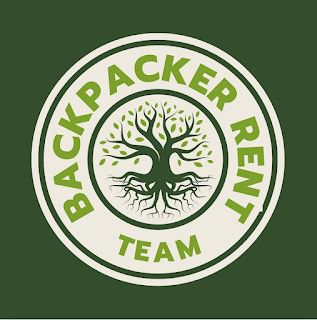

# 🏕 Backpacker Rent

**Teamname:** Backpacker Rent Team  
**Projektidee:** Plattform zur flexiblen Ausleihe von Reiseausrüstung

 <!-- ← Pfad ggf. anpassen -->

---

**Projektbeschreibung**

**Problem**

Reisende und Backpacker benötigen passende Ausrüstung für ihre Unternehmungen. Oft müssen sie teure Ausrüstung kaufen und während der gesamten Reise mit sich tragen – oder haben Schwierigkeiten, vor Ort geeignete Ausstattung zu finden.

Ob für eine Radtour, einen Roadtrip, ein Camping-Abenteuer oder eine klassische Backpacking-Reise: Viele Reisende wünschen sich **flexible, einfache Lösungen**, um hochwertige Ausrüstung **nur für den tatsächlichen Bedarf zu nutzen – ohne hohe Anschaffungskosten**.


Eine **Web-Plattform**, auf der Nutzer lokal Reise-Equipment wie:

- Rucksäcke
- Zelte
- Powerbanks
- Kameras  
... mieten und vermieten können – einfach, flexibel und nachhaltig.

Zielgruppe

Reisende und Backpacker, die **temporär Ausrüstung benötigen**, ohne sie dauerhaft besitzen zu müssen.

---

Projektziele

Ziel ist die Entwicklung einer Plattform, auf der Nutzer Equipment **vermieten, mieten und bewerten** können. Der Fokus liegt auf Nachhaltigkeit, Nutzerfreundlichkeit und Community.

---

Team & persönliche Ziele

**Jelena Berenz**

- Backend-Logik selbstständig umsetzen (Python)
- Kenntnisse in Datenbankanbindung & -pflege vertiefen
- Kreativität im UI-Design weiterentwickeln
- Teamfähigkeit durch aktives Feedback & Austausch stärken

**Panagiotis Tsangarakis**

- Python-Grundlagen erlernen und anwenden
- Eigenständig Webanwendungen mit Python entwickeln
- Umgang mit Datenbanken lernen & pflegen

**Aleyna Nur Özdemir**

- Python-Kenntnisse vertiefen
- Bessere Teamkommunikation erleben und mitgestalten
- Zusammenarbeit im Team als Stärke aufbauen


Datenbank:
In der aktuellen Datenbankstruktur bilden die Tabellen users und offers das Grundgerüst eines Systems zur Verwaltung und Vermietung von *Produkten*. Ziel ist es, eine Plattform bereitzustellen, auf der Nutzer verschiedene Gegenstände zur Miete anbieten können – zum Beispiel Zelte, technische Geräte oder andere physische Produkte.

Die users-Tabelle verwaltet alle registrierten Benutzer. Für jede Person werden der Vorname, Nachname, die E-Mail-Adresse, ein verschlüsseltes Passwort, die zugehörige Region sowie *verbindlich auch eine Telefonnummer* gespeichert. Diese Informationen sind notwendig, um Nutzer eindeutig zu identifizieren und eine sichere Kommunikation zwischen Mietenden und Vermietenden zu ermöglichen. Jede E-Mail-Adresse muss dabei eindeutig sein, um Dopplungen im System zu verhindern.

Die offers-Tabelle speichert die einzelnen *Produktangebote, die von den Benutzern eingestellt werden. Ein Angebot enthält Angaben wie den Titel, die zugehörige Kategorie, eine Beschreibung, die Region, den Preis pro Nacht sowie optional ein Foto, das per Dateipfad eingebunden wird. Jedes Angebot erhält außerdem eine Bewertung (z. B. durch Nutzerfeedback) und einen automatisch generierten Zeitstempel, der die Erstellung dokumentiert.

Aktuell besteht noch *keine direkte Verknüpfung zwischen Angeboten und ihren Erstellern*. Um dies langfristig sauber abzubilden, wäre es sinnvoll, die offers-Tabelle um ein Feld user_id zu erweitern, das als Fremdschlüssel auf die users-Tabelle verweist. Damit ließe sich eindeutig festhalten, *welcher Benutzer welches Produkt anbietet* – eine 1\:n-Beziehung, wie sie in solchen Systemen üblich ist.

Darüber hinaus ist bereits angedacht, künftig eine weitere Tabelle für *Buchungen* zu integrieren. Diese soll erfassen, *welcher Nutzer welches Produkt für welchen Zeitraum und zu welchem Preis gebucht hat*. Auch wenn diese Buchungstabelle aktuell noch nicht umgesetzt ist, ist sie ein zentraler Bestandteil der geplanten Funktionalität und wird in einem nächsten Schritt ergänzt werden.

**Anwendung starten**

**1. Virtuelle Umgebung aktivieren**

```bash
python -m venv venv
venv\Scripts\activate

