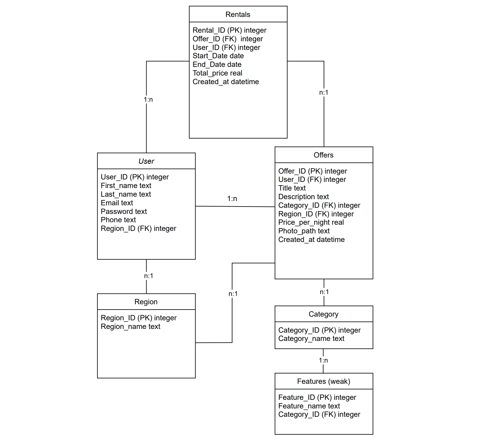

{: .no_toc }
# Data model

{: .text-delta }

Table of contents

+ ToC
{: toc }

# Data model picture

Im Mittelpunkt steht die Tabelle User, in der alle Nutzer der Plattform gespeichert sind. Jeder Nutzer kann sich registrieren und wählt eine Region zugeordnet, damit der User lokale Angebote finden kann.

Die Tabelle Offers enthält sämtliche Verleihangebote – darunter z. B. Fahrräder, Zelte oder Schlafplätze. Jedes Angebot ist mit einem Nutzer (dem Anbieter), einer Kategorie (z. B. „Zelt“, „Fahrrad“, „Schlafplatz“) sowie einer Region verknüpft. Um spezifische Merkmale wie „Anzahl Personen“ bei Zelten oder „Rahmengröße“ bei Fahrrädern abzubilden, existiert die Tabelle Features, deren Einträge kategorienabhängig sind.

Nutzer, die ein Angebot mieten möchten, erzeugen einen Eintrag in der Tabelle Rentals. Hier werden Informationen zur Buchungsdauer, zum Gesamtpreis sowie zu Start- und Enddatum gespeichert. Jede Buchung ist eindeutig einem Angebot und einem Nutzer zugeordnet.

