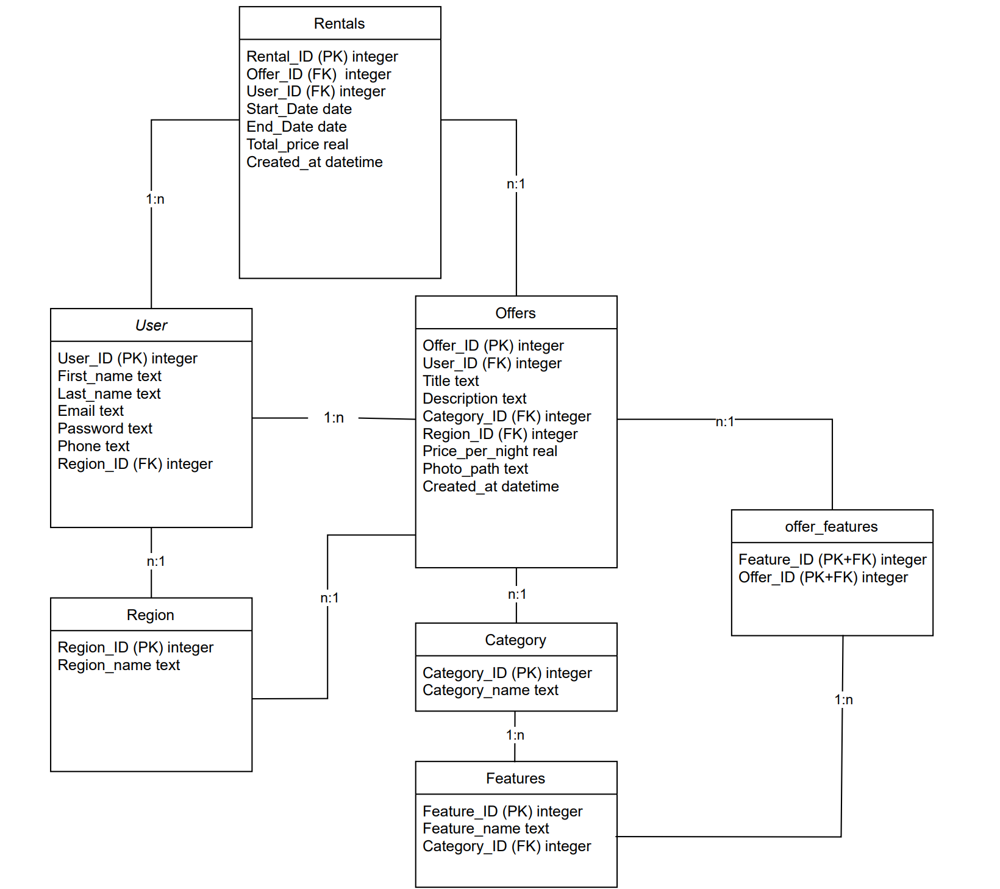

{: .no_toc }
# Data model

{: .text-delta }

Table of contents

+ ToC
{: toc }

# Data model picture

Im Mittelpunkt steht die Tabelle User, in der alle Nutzer der Plattform gespeichert sind. Jeder Nutzer kann sich registrieren und wählt eine Region, damit der User lokale Angebote finden kann. In der User-Tabelle sind persönliche Informationen wie Vorname, Nachname, E-Mail-Adresse, Passwort und Telefonnummer hinterlegt. Jeder User ist eindeutig über eine User_ID identifizierbar und einer Region zugeordnet.

Die Tabelle Region speichert alle verfügbaren Regionen. Jede Region wird durch eine Region_ID eindeutig identifiziert und hat einen Namen (Region_name). Eine Region kann mehreren Nutzern und mehreren Angeboten zugeordnet sein.

Die Tabelle Offers enthält sämtliche Verleihangebote – darunter z. B. Rucksäcke, Zelte oder Schlafsäcke. Jedes Angebot ist über eine Offer_ID eindeutig identifizierbar und wird mit einem User (dem Anbieter), einer Category (z. B. „Rucksack“, „Zelt“, „Schlafsack“) sowie einer Region verknüpft. Zudem enthält jedes Angebot Felder wie Title, Description, Price_per_night, Photo_path und Created_at (Zeitpunkt der Erstellung).

Die Tabelle Category speichert die verschiedenen Kategorien von Angeboten. Jede Kategorie hat eine eindeutige Category_ID und einen Category_name. Eine Kategorie kann mehreren Angeboten zugeordnet sein und ist auch Grundlage für die möglichen Features.

Um spezifische Merkmale wie „Kapazität (Anzahl Personen)“ bei Zelten oder „Gewicht“ bei Rucksäcken abzubilden, existiert die Tabelle Features, deren Einträge kategorienabhängig sind. Jedes Feature hat eine eindeutige Feature_ID, einen Feature_name sowie eine Category_ID als Fremdschlüssel, der angibt, zu welcher Kategorie das Feature gehört.

Die Zuordnung von Features zu konkreten Angeboten erfolgt über die Tabelle offer_features. Diese bildet eine n:m-Beziehung zwischen Offers und Features ab. Sie enthält die Offer_ID und die Feature_ID als zusammengesetzten Primärschlüssel, wodurch eindeutig festgelegt wird, welche Features einem Angebot zugeordnet sind.

Nutzer, die ein Angebot mieten möchten, erzeugen einen Eintrag in der Tabelle Rentals. Hier werden Informationen zur Buchungsdauer (Start_Date, End_Date), zum Total_price sowie zum Created_at (Zeitpunkt der Buchung) gespeichert. Jede Buchung ist eindeutig einem Angebot (Offer_ID) und einem Nutzer (User_ID) zugeordnet und wird über eine Rental_ID identifiziert.

